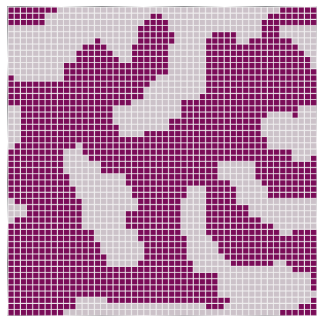

# Ising Model

## Summary

The Ising model was first developed by Ising as a model for ferromagnetism (Ising, 1925) and has historically played a major role in the development of Statistical Physics and Quantum Field Theory (Anagnostopoulos, 2016). Its two-dimensional version exhibits a phase transition of second order and can be applied to the study of the liquid-to-gas phase transition.

In its 2-D version presented here, the model is composed of atoms having either their spin "up", or "down" occupying each position in a square lattice. The atoms interact based on the spin-spin interaction. The presence of an external magnetic field is also simulated.

## How to run
To launch the model run:

```
python ising/run.py
```
Make sure to install the requirements first:
```
pip install -r requirements.txt
```
## Files

- [model.py](model.py): the 2-D Ising model
- [agents.py](agents.py): code containing the Ising Spin agent 
- [server.py](server.py): code for interactive visualization
- [run.py](run.py): code to launch the server that visualizes a model run

## Typical run


# References

- Anagnostopoulos, K. (2016, January). *Computational Physics*. Kallipos, Open Academic
Editions. Retrieved April 4, 2024, from https://dx.doi.org/10.57713/kallipos-946
- Ising, E. (1925). Beitrag zur Theorie des Ferromagnetismus. *Zeitschrift f ̈ur Physik, 31*(1),
253–258. https://doi.org/10.1007/BF02980577